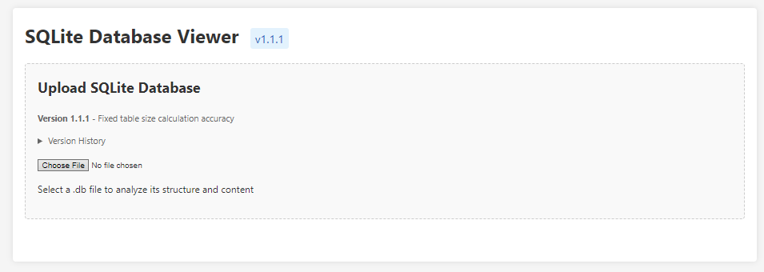

# SQLite Database Viewer

A lightweight, browser-based tool for viewing and analyzing SQLite database files. This application allows you to upload a SQLite database file (.db, .sqlite, .sqlite3) and examine its structure and contents without requiring any server-side components.

## Features

- **Client-side Only**: Runs entirely in the browser, no server required
- **Table Browser**: View all tables in your database with easy navigation
- **Schema Viewer**: Examine table structure, column types, and constraints
- **Data Explorer**: Browse table data with clean, formatted output
- **Table Size Analysis**: View estimated size of each table in KB
- **CSV Export**: Export table data to CSV format for further analysis
- **Size Tracking**: Monitor database size over time with visual chart
- **Reserved Keyword Support**: Properly handles SQLite reserved keywords and special table names

## Usage

1. Open the HTML file in any modern web browser
2. Click the file selection box and choose a SQLite database file
3. Browse tables in the left sidebar
4. View schema and data in the main panel
5. Use the export button to download table data as CSV

## Implementation Details

This tool uses the following technologies:

- **SQL.js**: Pure JavaScript SQLite implementation
- **Chart.js**: For data visualization
- **Vanilla JavaScript**: No framework dependencies
- **CSS3**: For styling and responsive design

The table size estimation feature uses a sophisticated algorithm to:
1. Sample rows from each table
2. Calculate storage requirements based on data types and actual content
3. Scale values proportionally to match the real database file size
4. Display the results in a user-friendly format

## Version History

- **v1.1.1**: Fixed table size calculation to provide accurate proportional sizes
- **v1.1.0**: Added table size estimation, size badges, and table sizes panel
- **v1.0.0**: Initial release with basic SQLite viewing capabilities

## Browser Compatibility

Tested and working in:
- Chrome (latest)
- Firefox (latest)
- Edge (latest)
- Safari (latest)

## Limitations

- Maximum database file size is limited by browser memory constraints
- Performance may degrade with very large databases (>100MB)
- Complex SQL queries are not supported (view-only functionality)

## License

MIT License - Feel free to use, modify, and distribute as needed.

## Contributing

Contributions are welcome! Please feel free to submit a Pull Request.

## Screenshots

### Main Interface

